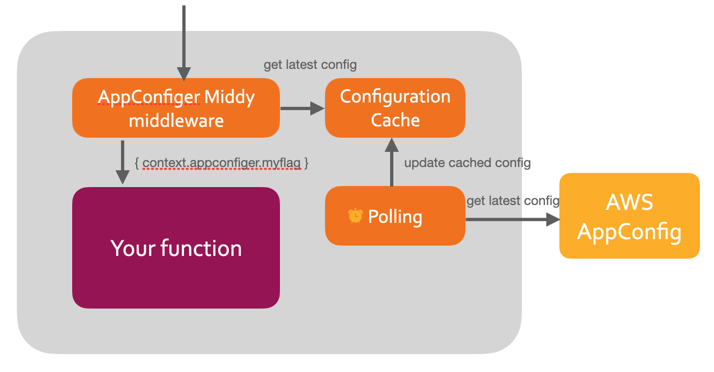

# appconfiger

JS lib for making it easier to use AWS AppConfig feature flags.

This lib uses AWS SDK and adds the following capabilities on top of it:

- Caches configuration responses
  - AWS SDK returns the full configuration contents only when it is changed (this is an optimization strategy)

- Fetches new configuration in background from time to time (polling period)
  - When you request the configuration it will return immediatelly the cached response, even if stale, while it fetches the newer configuration in background to avoid adding latency to your main process

- Middy middleware will add the attribute `appconfiger` to the Lambda context with the AppConfig configuration contents, or can disable the Lambda function entirely if a certain feature flag is not activated.



You can use it as:

- [Middy Middleware for AWS Lambda functions](middy/README.md)
- [Core library for anything else](core/README.md)
- [Check a working example here](examples/random-number-lambda/README.md)
  - Serverless Framework, Middy and Cloudformation definitions for AppConfig, unit tests with mocked AppConfig etc

We are Typescript friendly :)

## Sample usage for AWS Lambda

- In this example, we will disable the Lambda function if the feature flag "random-number-enable" is disabled or doesn't exist in AWS AppConfig. It will check if the feature flag was changed every 5 minutes.

- `npm install --save @appconfiger/middy`

- Create AWS Lambda function exposed through AWS API Gateway and use the Middy middleware

```js
import appConfigerMiddy from '@appconfiger/middy';

const handler = middy((event, context) => {
  console.log(`Running function on ${new Date()}`);
  return { message: `This function was run on ${new Date()}` };
});

handler.use(
  appConfigerMiddy({
    applicationId: 'aaaaa', //from AppConfig
    configurationProfileId: 'bbbbb', //from AppConfig
    environmentId: 'ccccc', //from AppConfig
    featureFlag: 'myFunctionFlag',
    pollingInterval: 300
  }),
);

```

## How to test

- [Check a working example here](examples/random-number-lambda/README.md)

## Specific documentation

- [Middy Middleware for AWS Lambda functions](middy/README.md)
- [Core Idempotender lib](core/README.md)
